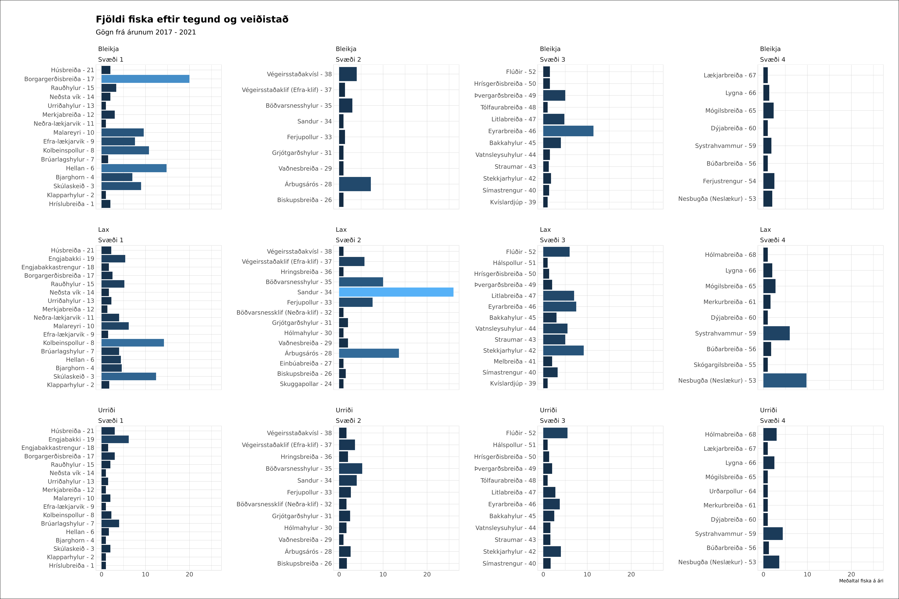
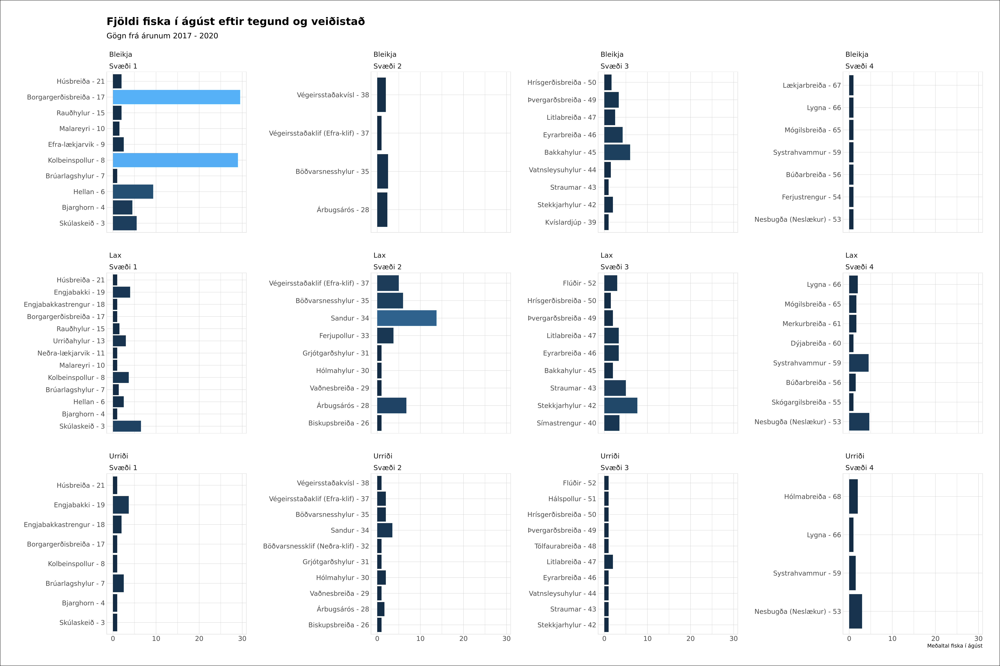

# Analysing fishing data from Fnjóská

This analysis was done because a friend of mine was going fishing in Fnjóská. Because Fnjóská gives a nice report on all fishes cought on the web, I thought it would be interesting to see if one fishing spot was better than another.

There are two scripts in this analysis. The first one written in python; `Data.ipynb` which gathers and fixes data from the website. The data is written to the file `data.csv`. The second part is the analysis which is written in R; `Plot.ipynb`, which creates two plots.

Because the friend of mine was going fishing in August, I made two plots. The first one shows how all the fishing spots have performed for the three types of fish cought in Fnjóska, over the past 5 years.

The second image shows how the fishing spots perform in august for the past 4 years, excluding 2021.

